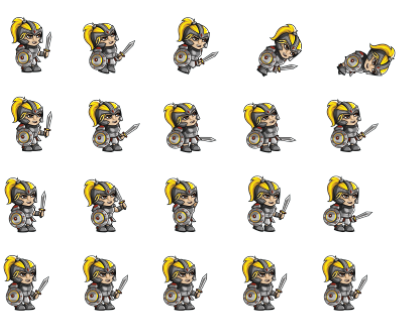

<h1>
  PHASER 3 + VITE = READY TO START TEMPLATE
</h1>

<h2 align="center">
   
  <a href="https://github.com/photonstorm/phaser"> 

  Phaserjs 3
  

  </a>
  
  
  
MATH FIGHTER 

  

Using Phaser Engine To create a MATH FIGHTER GAME
  

</h2>
